# Data Charts Visualization

Turn structured data into polished static charts through one lightweight CLI.

This skill is built for agent workflows that need chart output fast, reliably, and without dragging in a browser stack. It gives you broad chart coverage, an agent-friendly `data / config / variant` contract, and enough styling power to move from "just render it" to "make it production-ready".

## Why This Skill

- Rich chart support: line, bar, pie, donut, rose, gauge, area, dual-axis, scatter, bubble, radar, and funnel.
- Lightweight runtime: render static images without Chromium, Playwright, or browser automation.
- Powerful configuration: per-chart persistent presets, inline config overrides, and one-off variants for shape decisions.
- Agent-friendly contract: keep business data in `data`, reusable style rules in `config`, and one-off render choices in `variant`.
- ECharts-friendly input model: supports familiar structures such as `series`, `xAxis`, `yAxis`, `dataset.source`, and `series.encode`.
- Predictable output: stable CLI behavior, static assets, and test-generated sample images for every major chart family.

## Showcase

<table>
  <tr>
    <td align="center" width="33%">
      <strong>Line</strong><br/>
      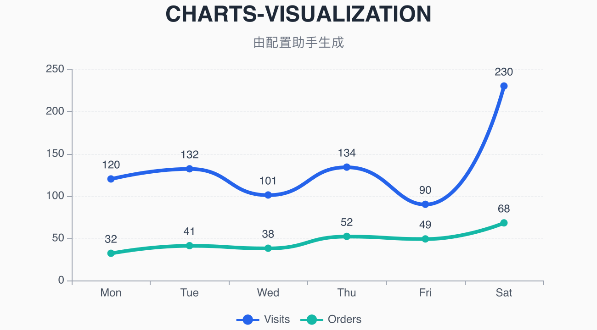
    </td>
    <td align="center" width="33%">
      <strong>Bar</strong><br/>
      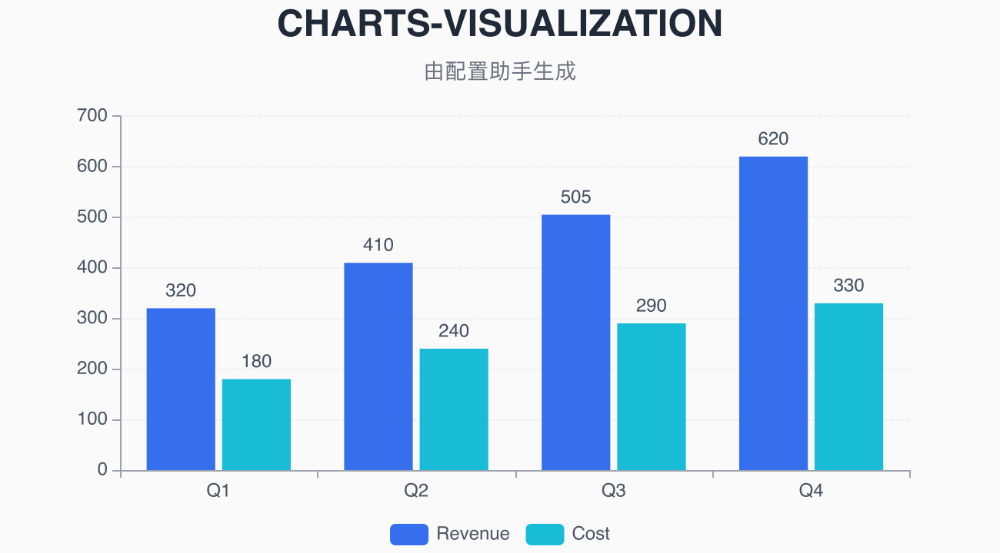
    </td>
    <td align="center" width="33%">
      <strong>Area</strong><br/>
      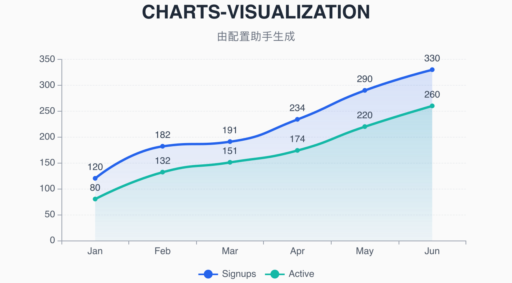
    </td>
  </tr>
  <tr>
    <td align="center">
      <strong>Dual-Axis</strong><br/>
      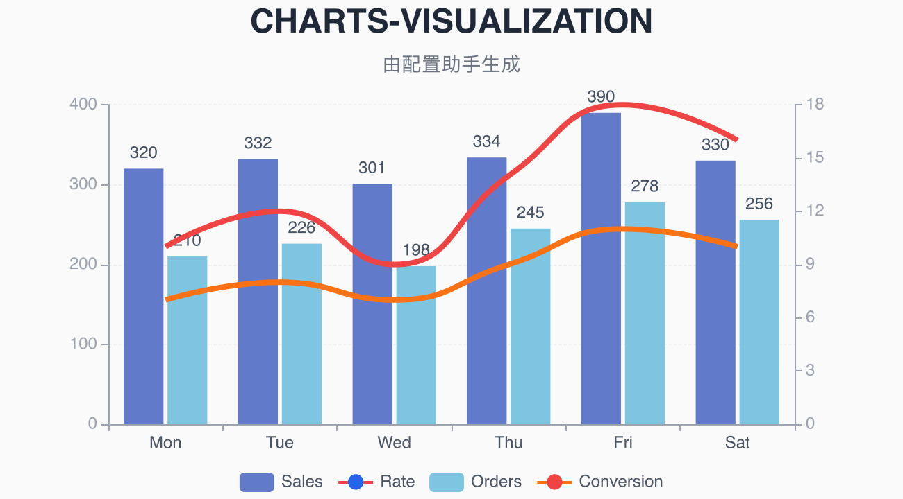
    </td>
    <td align="center">
      <strong>Dual-Axis Horizontal Style</strong><br/>
      
    </td>
    <td align="center">
      <strong>Scatter</strong><br/>
      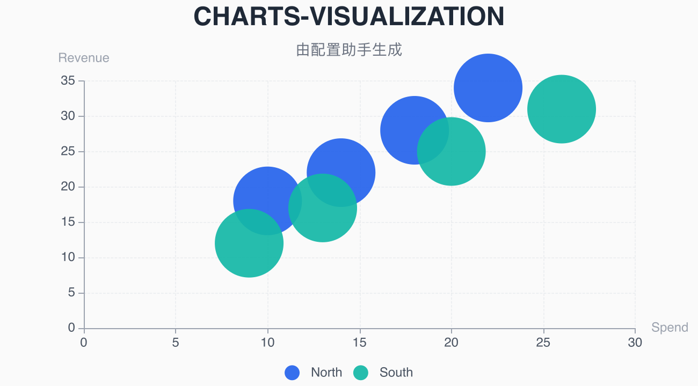
    </td>
  </tr>
  <tr>
    <td align="center">
      <strong>Pie</strong><br/>
      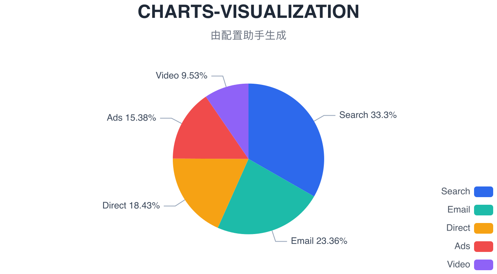
    </td>
    <td align="center">
      <strong>Donut</strong><br/>
      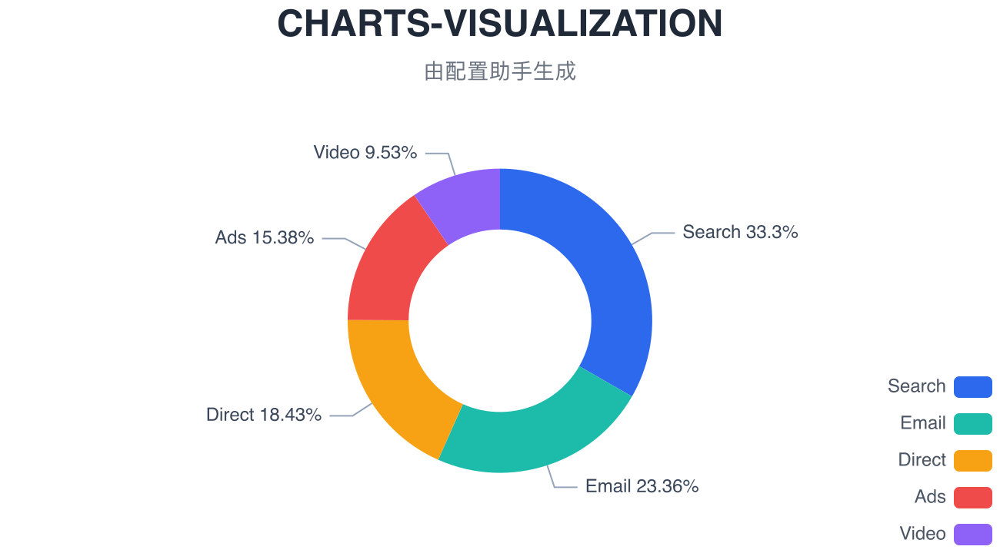
    </td>
    <td align="center">
      <strong>Rose</strong><br/>
      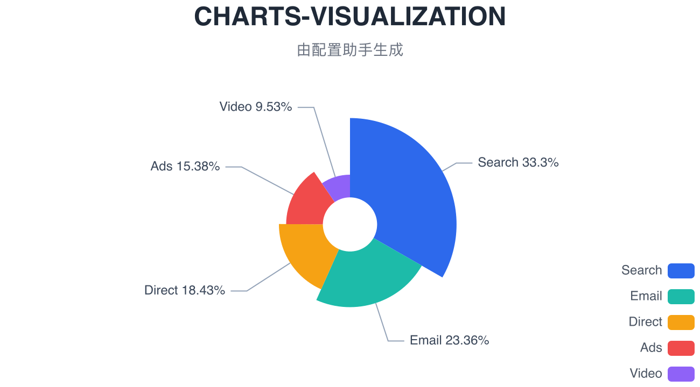
    </td>
  </tr>
  <tr>
    <td align="center">
      <strong>Gauge</strong><br/>
      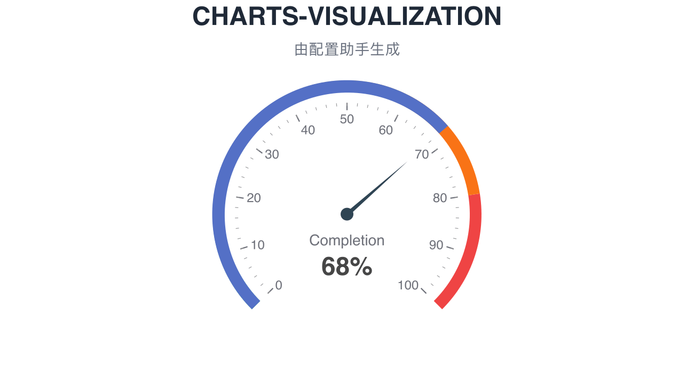
    </td>
    <td align="center">
      <strong>Radar</strong><br/>
      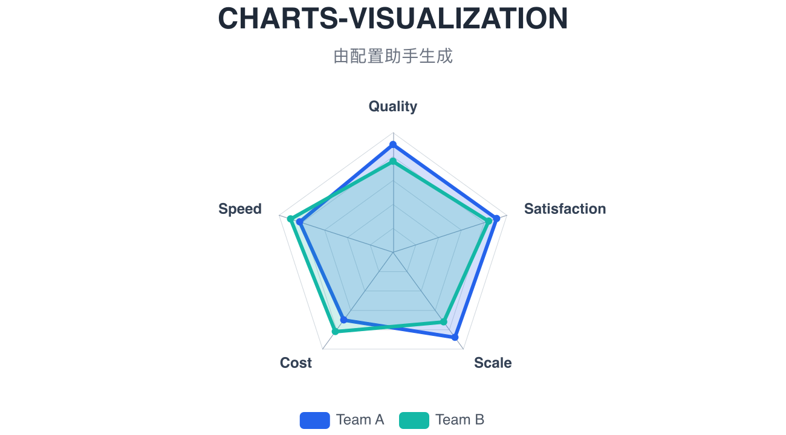
    </td>
    <td align="center">
      <strong>Funnel</strong><br/>
      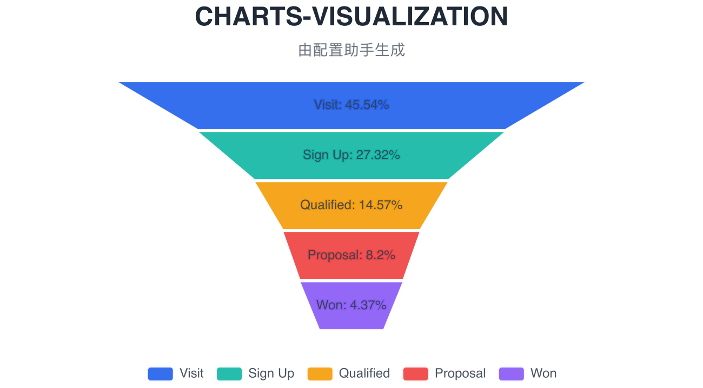
    </td>
  </tr>
</table>

## Built For Agents

This skill is aimed at OpenClaw-like agents and other automation flows that need deterministic chart rendering instead of interactive BI sessions.

- One CLI for all supported chart families: `areslabs-data-charts`
- Static image output by default, ideal for reports, dashboards, tickets, and generated assets
- No browser dependency, which keeps environments simpler and cheaper to run
- A small, explicit contract that makes chart generation easier to reason about than passing arbitrary raw styling blocks

## Configuration Power

This is where the skill separates itself from a thin chart wrapper.

- Persistent chart presets: each chart type owns its default config under `config/<chart>_style.json`
- Temporary style overrides: merge one-off changes and pass them inline with `--config`
- Render variants: use `--variant` for choices such as horizontal bar, stacked bar, donut, rose, or dual-axis series typing
- Structured style schema: the config model is built for chart styling, not as a dump of raw browser-only options
- Visual tuning path: when you want hands-on style exploration, use the config page and then bring the generated config back into the render flow

Config page addresses:

- 中文地址：`https://ykforerlang.github.io/awesome-skills/skills-helpler/data-charts-visualization/web/index.zh.html`
- 英文地址：`https://ykforerlang.github.io/awesome-skills/skills-helpler/data-charts-visualization/web/index.html`

## What You Can Feed Into It

The skill works well with the data shapes agents already produce:

- raw `series` plus `xAxis` / `yAxis`
- `dataset.source` plus `series.encode`
- table-like data transformed into chart-ready payloads
- pie, funnel, radar, and gauge specific raw data structures
- one-off business-chart requests such as donut charts, horizontal stacked bars, or dual-axis bar-line combinations

## Quick Start

Published package:

```bash
npx -y @areslabs/data-charts-visualization \
  --chart-type line \
  --config-file skills/data-charts-visualization/config/line_style.json \
  --data-file /tmp/line_basic_two_series.json \
  --out /tmp
```

Primary CLI:

```bash
areslabs-data-charts \
  --chart-type line \
  --config-file skills/data-charts-visualization/config/line_style.json \
  --data-file /tmp/line_basic_two_series.json \
  --out /tmp
```

Inline data:

```bash
areslabs-data-charts \
  --chart-type bar \
  --config-file skills/data-charts-visualization/config/bar_style.json \
  --data '{"xAxis":{"data":["Q1","Q2","Q3","Q4"]},"yAxis":{},"series":[{"type":"bar","name":"Plan","data":[120,140,150,170]},{"type":"bar","name":"Actual","data":[128,135,162,181]}]}' \
  --out /tmp
```

One-off variant:

```bash
areslabs-data-charts \
  --chart-type dualAxis \
  --config-file skills/data-charts-visualization/config/dual_axis_style.json \
  --data-file /tmp/dual_axis_two_series.json \
  --variant '{"leftSeriesType":"bar","rightSeriesType":"line","splitLineFollowAxis":"left"}' \
  --out /tmp
```

## Best Fit

Use this skill when you want to:

- render production-friendly static charts from agent-generated data
- keep chart syntax close to ECharts without depending on a browser runtime
- standardize report visuals through persistent chart presets
- support both quick default rendering and deep style customization
- cover most business chart requests with one consistent toolchain
