# Data Charts Visualization

Render static chart images with Apache ECharts SSR in Node.js, using the same helper-driven option pipeline as the web helper.

[中文说明](./README.zh.md)

This skill is built for agent workflows that need charts fast, with predictable output and production-friendly configuration. It keeps the option model close to ECharts, uses the helper config schema as the public style contract, and renders through `ECharts SSR -> SVG -> PNG`.

## Why This Skill

- Rich chart coverage: line, bar, pie, donut, rose, gauge, area, dual-axis, scatter, bubble, radar, and funnel.
- ECharts-aligned option model: low learning cost if your data or prompts already target ECharts.
- Shared helper config model: the same config structure drives helper preview rendering and skill rendering.
- Single-preset configuration model: each chart type owns one persistent helper config file under `config/*.json`.
- Dataset support: plain arrays, object arrays, `dataset.source`, and `series.encode`.
- Stable rendering workflow: every chart type is covered by golden-image test cases.

## Supported Charts

<table>
  <tr>
    <td align="center" width="33%">
      <strong>Line</strong><br/>
      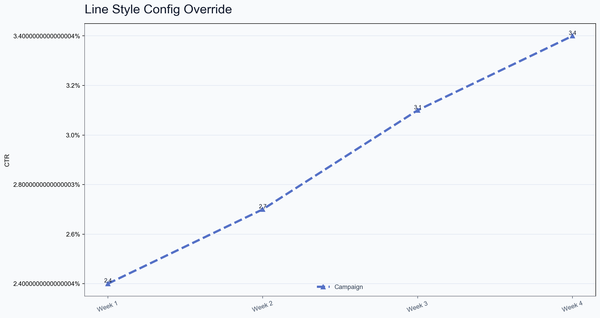
    </td>
    <td align="center" width="33%">
      <strong>Bar</strong><br/>
      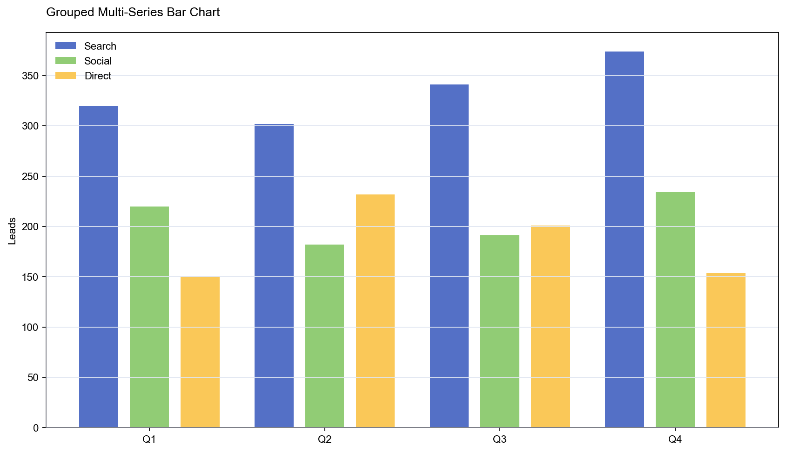
    </td>
    <td align="center" width="33%">
      <strong>Pie</strong><br/>
      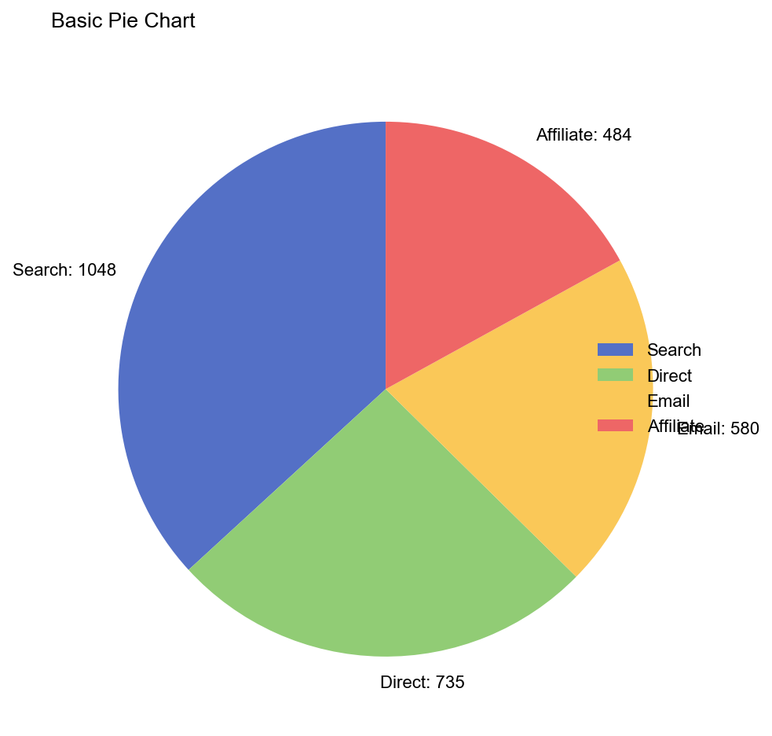
    </td>
  </tr>
  <tr>
    <td align="center">
      <strong>Donut</strong><br/>
      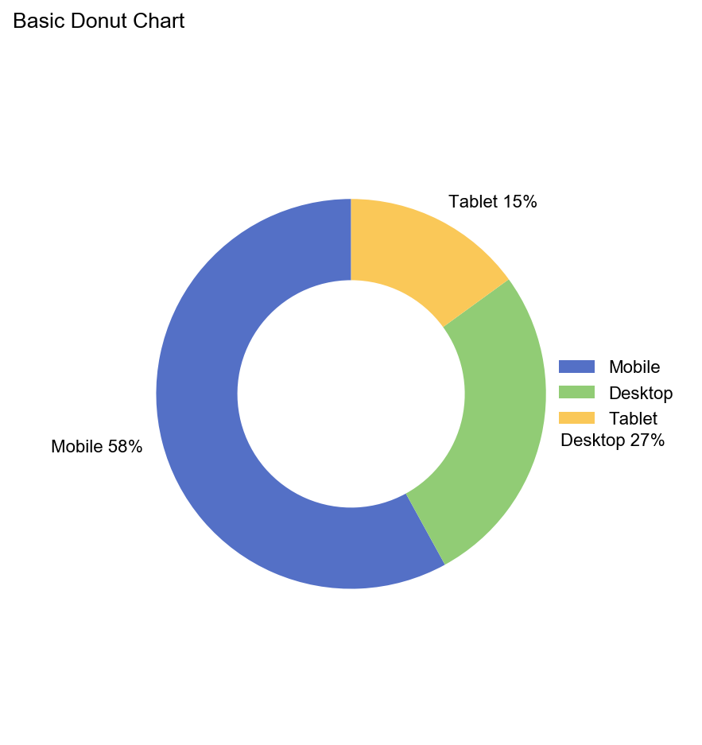
    </td>
    <td align="center">
      <strong>Rose</strong><br/>
      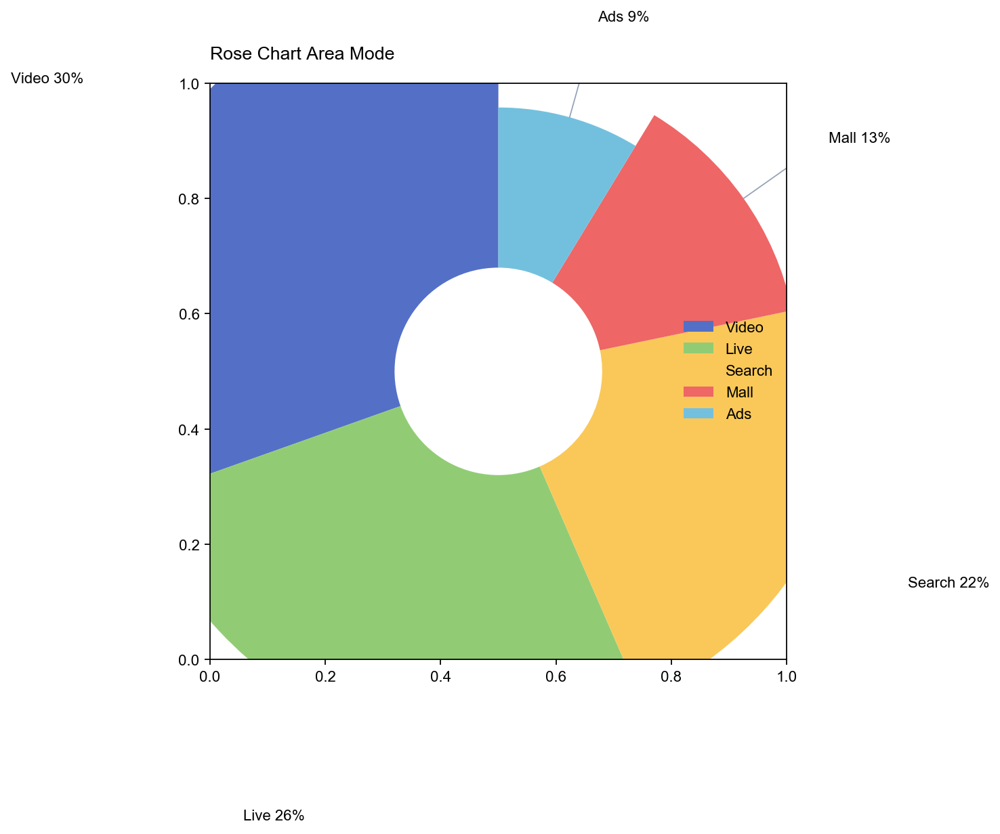
    </td>
    <td align="center">
      <strong>Gauge</strong><br/>
      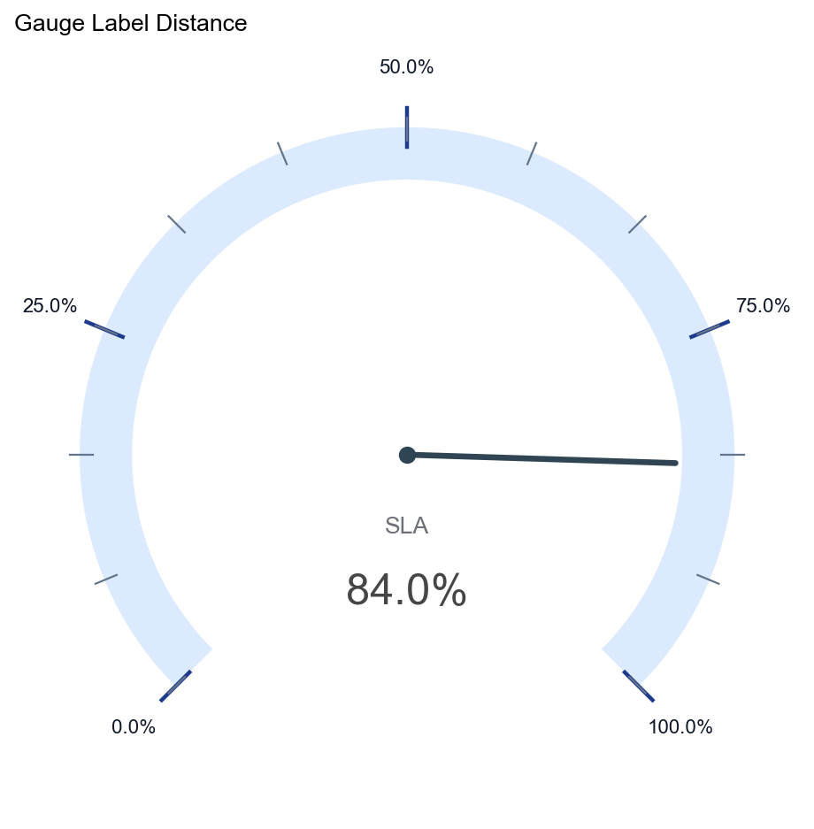
    </td>
  </tr>
  <tr>
    <td align="center">
      <strong>Area</strong><br/>
      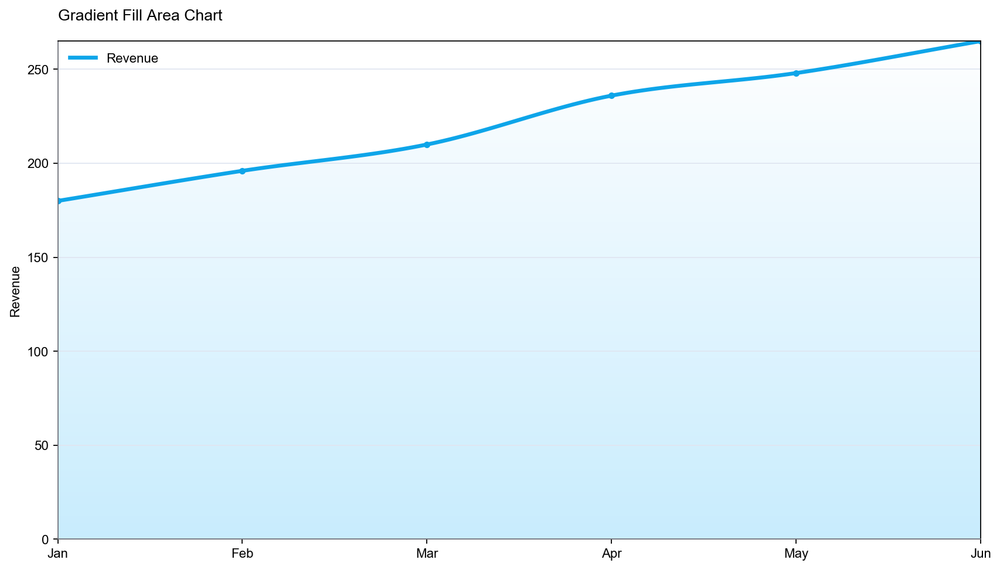
    </td>
    <td align="center">
      <strong>Dual-Axis</strong><br/>
      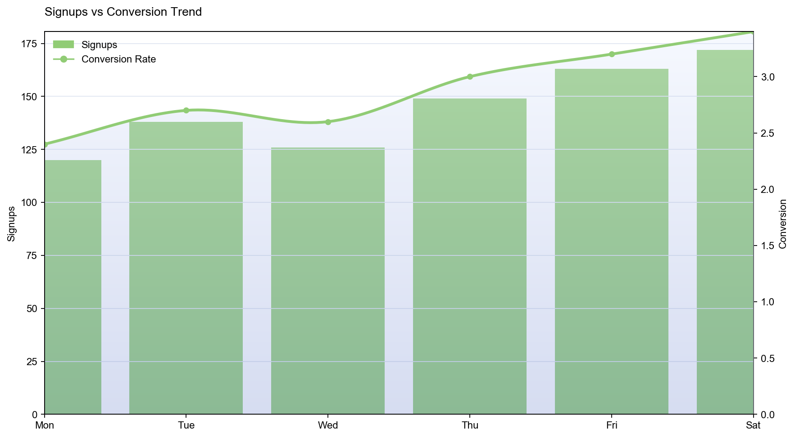
    </td>
    <td align="center">
      <strong>Scatter</strong><br/>
      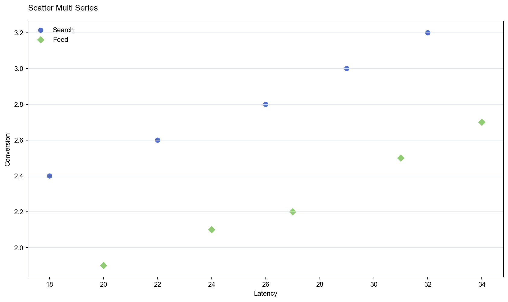
    </td>
  </tr>
  <tr>
    <td align="center">
      <strong>Bubble</strong><br/>
      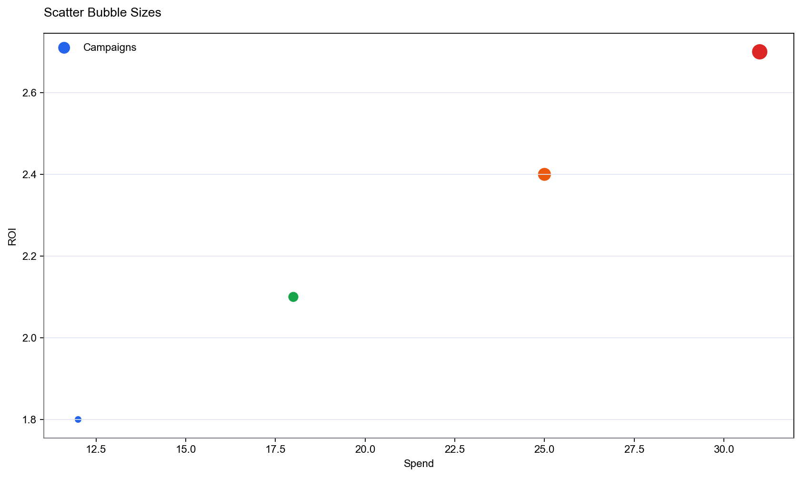
    </td>
    <td align="center">
      <strong>Radar</strong><br/>
      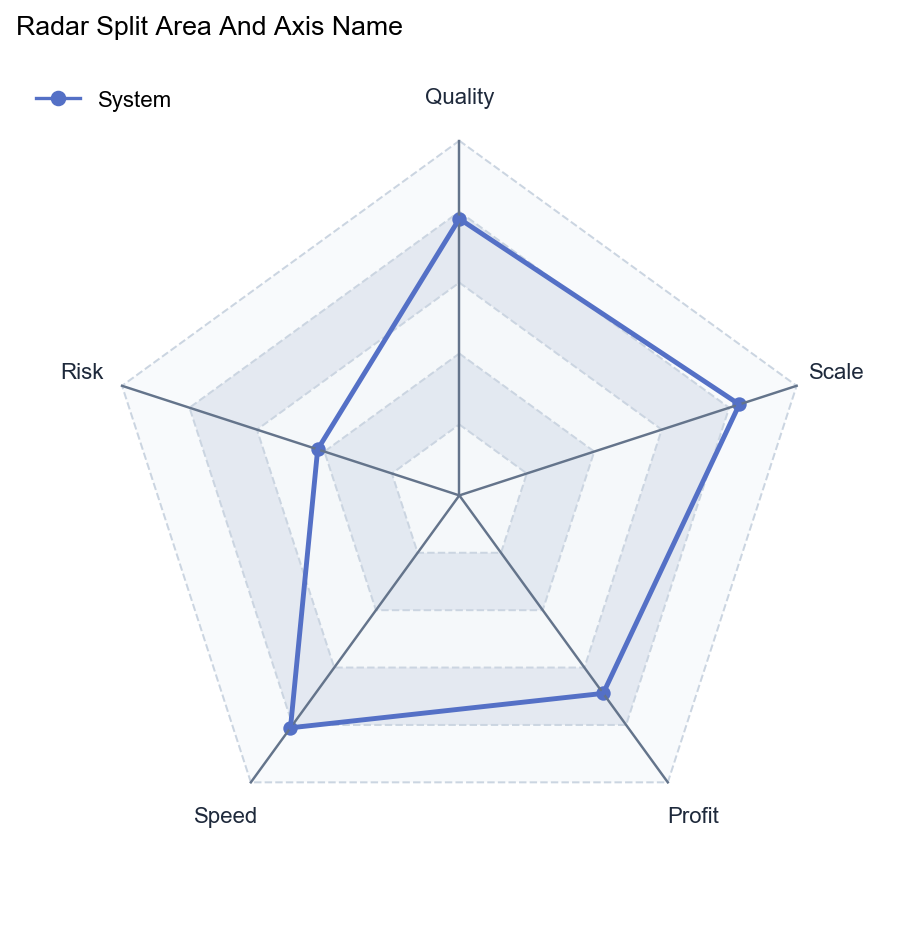
    </td>
    <td align="center">
      <strong>Funnel</strong><br/>
      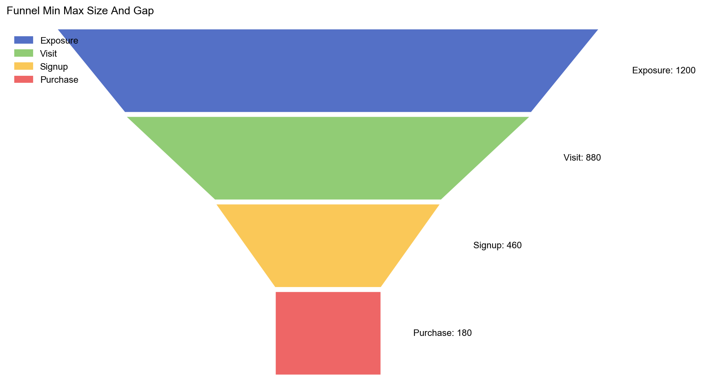
    </td>
  </tr>
</table>

## Core Capabilities

This skill is not just a thin chart wrapper. It already covers the chart behaviors that show up most often in ECharts usage:

- Multi-series charts, mixed chart compositions, grouped bars, stacked bars, and stacked areas.
- Dataset-driven charts with `dataset.source` and `series.encode`, including table-header style 2D arrays.
- Common interaction-independent styling such as legend placement, palette control, labels, axis formatting, grid layout, and background color.
- Line and area behaviors such as `smooth`, `step`, `showSymbol`, `null` gaps, and `connectNulls`.
- Pie-family variants such as pie, donut, rose charts, label positions, selected offsets, start angles, and palette overrides.
- Gauge capabilities such as segmented axis lines, progress arcs, custom angles, custom ranges, pointer styles, and detail formatting.
- Dual-axis combinations with independent axis mapping, mixed bar/line rendering, horizontal layout, negative values, and area-on-secondary-axis support.
- Scatter, bubble, radar, and funnel support for their common business-reporting scenarios, including bubble sizes, split areas, item styling, sorting, and size/gap control.

## Configuration Model

The configuration path is intentionally simple:

1. Put chart data and structure in `option`.
2. Keep reusable helper-style visual rules in the corresponding `config/<chart>_style.json`.
3. Resolve one final ECharts option through the shared helper option builder, then render it through SSR.

The skill does not independently approximate chart styling anymore. It resolves the same final ECharts option structure that the helper uses, then feeds that option into ECharts SSR.

Available presets:

- `config/line_style.json`
- `config/bar_style.json`
- `config/pie_style.json`
- `config/gauge_style.json`
- `config/area_style.json`
- `config/dual_axis_style.json`
- `config/scatter_style.json`
- `config/radar_style.json`
- `config/funnel_style.json`

Each chart preset is self-contained, so editing one chart type no longer changes the defaults of other chart types.

## Quick Start

Primary CLI:

```bash
data-charts-visualization render --chart-type line --option /tmp/line_basic_single_series.json --output /tmp/line.png
```

Repo-local `npx` invocation without install/link:

```bash
npx --yes --package ./skills/data-charts-visualization data-charts-visualization render --chart-type line --option /tmp/line_basic_single_series.json --output /tmp/line.png
```

Inside this repo, the same entry can be called directly through the script:

```bash
node skills/data-charts-visualization/scripts/cli.js render \
  --chart-type line \
  --option /tmp/line_basic_single_series.json \
  --output skills/data-charts-visualization/test/manual/manual_line_chart.png
```

The recommended way to prepare that option file is to start from the shared default data source:

- `skills-helpler/data-charts-visualization/shared/charts-default-data.js`

Render the same chart with an explicit helper config:

```bash
node skills/data-charts-visualization/scripts/cli.js render \
  --chart-type line \
  --style-config skills/data-charts-visualization/config/line_style.json \
  --option /tmp/line_basic_single_series.json \
  --output skills/data-charts-visualization/test/manual/manual_line_chart_styled.png
```

## Reliability

The maintained validation flow is centered around the preview matrix generator under `test/scripts/`. Shared demo/default inputs live in `skills-helpler/data-charts-visualization/shared/charts-default-data.js`, and shared default config lives in `skills-helpler/data-charts-visualization/shared/charts-default-config.js`.

Typical coverage includes:

- basic rendering
- dataset + encode
- style config overrides
- legend and palette variations
- axis and label formatting
- null handling and line continuity where applicable
- chart-specific advanced behaviors such as rose pie, segmented gauge, horizontal dual-axis, radar split area, and funnel ordering

## Best Fit

Use this skill when you need one of these outcomes:

- render a chart directly from structured option JSON
- keep chart syntax close to ECharts while producing static images locally
- maintain consistent report styling across many chart renders
- keep helper config and skill rendering on one shared contract
